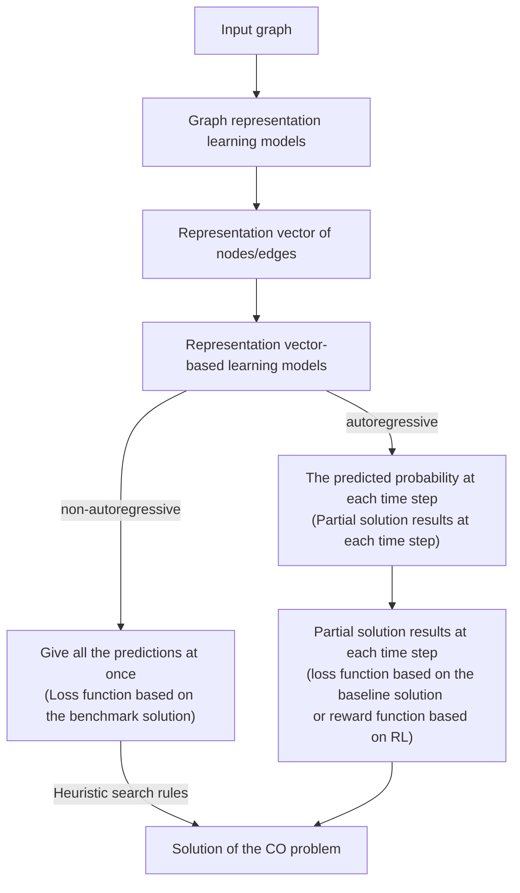

Notes from a lecture conference, introduced some progress of machine learning solving combinatorial optimization problems, especially combinatorial optimization problems on graphs, including autoregression-based methods and non-autoregression-based methods.

# Machine learning solution of combinatorial optimization problems [^1]
[^1]: This [report](https://pattern.swarma.org/study_group_issue/483) is given by Assoc. Prof. Changjun FAN, National University of Defense Technology.

## CO and ML4CO
### Combinatorial optimization

- Combinatorial optimization is to find the optimal arrangement, grouping, order or screening of discrete events through the study of mathematical methods. The problem can be described mathematically as:$$
  min \quad f(x) \\
  s.t. \quad g(x) \geq 0 \\
  \qquad x \in D
  $$Where $D$ is a set of finite points (the domain), $f$ is the objective function, and $F= \{ x | x \in D, \ g(x) \geq 0\}$ is the feasible region.
- 0-1 knapsack problem, traveling salesman problem, minimum vertex cover problem, maximum cut problem and so on.

### Machine learning for combinatorial optimization
#### Optimization algorithms

- Mathematical Optimization algorithms - Exact algorithms (Exponential time)
  - Branch and bound, Branch and price, Branch and cut, Cutting plane, Lagrangian relaxation
- Heuristic algorithms (Polynomial time)
  - Approximation algorithm, Greedy algorithm, Rule-based construction algorithm
- Meta heuristic algorithms (Polynomial time)
  - Genetic algorithm, Ant colony algorithm, Tabu search, Simulated annealing
- Machine learning methods (Polynomial time)
  - Supervised learning, Reinforcement learning, Graph neural networks

#### Combinatorial Optimization Solvers

- Commercial Solvers
  - Gurobi, CPLEX, Matlab, Lingo, CMIP
- Open Source Solvers
  - SCIP, LP_Solve, CBC, GLPK, MOSEK

#### Past and Now

- Traditional solvers: Moderate scale, relatively stable, classical problem, theoretical guarantee
- Machine learning: Super large scale, real-time change, complex system, weak optimization

#### Machine learning paradigms for solving CO problems

- End-to-end solver $\rightarrow$ autoregressive/non-autoregressive $\rightarrow$ Learning heuristics
- Local improvement solution $\rightarrow$ ML + Traditional operations algorithm $\rightarrow$ Improving OR Solvers

## Combinatorial optimization problem solving on the graph

### Non-autoregressive algorithms

- Supervised learning + Tree search + Graph theory tricks
- Li Z, Chen Q, Koltun V. [Combinatorial optimization with graph convolutional networks and guided tree search](https://proceedings.neurips.cc/paper/2018/file/8d3bba7425e7c98c50f52ca1b52d3735-Paper.pdf)[J]. Advances in neural information processing systems, 2018, 31.

### Autoregressive algorithms

- S2V - DQN
  - Khalil E, Dai H, Zhang Y, et al. [Learning combinatorial optimization algorithms over graphs](https://proceedings.neurips.cc/paper/2017/file/d9896106ca98d3d05b8cbdf4fd8b13a1-Paper.pdf)[J]. Advances in neural information processing systems, 2017, 30.
- FINDER
  - Fan C, Zeng L, Sun Y, et al. [Finding key players in complex networks through deep reinforcement learning](https://www.ncbi.nlm.nih.gov/pmc/articles/PMC8191335/pdf/nihms-1595705.pdf)[J]. Nature machine intelligence, 2020, 2(6): 317-324.
- DIRAC
  - Fan C, Shen M, Nussinov Z, et al. [Searching for spin glass ground states through deep reinforcement learning](https://www.nature.com/articles/s41467-023-36363-w.pdf)[J]. Nature Communications, 2023, 14(1): 725.
  - Lucas A. [Ising formulations of many NP problems](https://www.frontiersin.org/articles/10.3389/fphy.2014.00005/full)[J]. Frontiers in physics, 2014, 2: 5.
  - Barrett T, Clements W, Foerster J, et al. [Exploratory combinatorial optimization with reinforcement learning](https://aaai.org/ojs/index.php/AAAI/article/view/5723/5579)[C]//Proceedings of the AAAI conference on artificial intelligence. 2020, 34(04): 3243-3250.
  - Yao F, Cai R, Wang H. [Reversible action design for combinatorial optimization with reinforcement learning](https://arxiv.org/pdf/2102.07210.pdf)[J]. arXiv preprint arXiv:2102.07210, 2021.

### Summary of autoregressive algorithms

Graph Representation Learning + Reinforcement Learning
- Pros
  - The model generalizes well
  - The model works well
  - It has some interpretability
- Cons
  - Model design and learning are difficult
  - Implementation is difficult

## Some interesting research points

1. How to combine with exact algorithms?
   - Nair V, Bartunov S, Gimeno F, et al. [Solving mixed integer programs using neural networks](https://arxiv.org/pdf/2012.13349.pdf)[J]. arXiv preprint arXiv:2012.13349, 2020.
2. How to combine with heuristics?
   - Mills K, Ronagh P, Tamblyn I. [Finding the ground state of spin Hamiltonians with reinforcement learning](https://arxiv.org/pdf/2003.00011.pdf)[J]. Nature Machine Intelligence, 2020, 2(9): 509-517.
3. How to improve generalization on large instances?
   - Fu Z H, Qiu K B, Zha H. [Generalize a small pre-trained model to arbitrarily large TSP instances](https://ojs.aaai.org/index.php/AAAI/article/download/16916/16723)[C]//Proceedings of the AAAI conference on artificial intelligence. 2021, 35(8): 7474-7482.
4. How do you handle complex constraints?
   - Donti P L, Rolnick D, Kolter J Z. [DC3: A learning method for optimization with hard constraints](https://arxiv.org/pdf/2104.12225.pdf)[J]. arXiv preprint arXiv:2104.12225, 2021.
5. How to combine with mature solvers?
   - Pogančić M V, Paulus A, Musil V, et al. [Differentiation of blackbox combinatorial solvers](https://openreview.net/pdf?id=BkevoJSYPB)[C]//International Conference on Learning Representations. 2019.
6. How do you handle raw inputs that are more natural?
   - ChatGPT understands natural language problem requirements, models them automatically, and invokes a solver to solve them.
